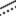

User interface
==============

The project tree
----------------

The tree view on the right side of the main window reflects the structure of the
project. All the data sets of one plot  are shown together in the plot area left
of the  tree.  The  currently selected set  is displayed in  red, the  others in
black. You  can select all  sets of a plot  by selecting the  corresponding plot
item  or a  subset of  sets within  one plot  by pressing  SHIFT/CTRL-keys while
selecting.  Sets can  be hidden and will thus  show up in the plot  area only if
they are part of the current selection.  The tree supports drag&drop of plot and
set items. CLick twice slowly on any tree item to rename its label. Right-ckling
opens  a   context  pop-up  menu   which  allows  for  deattaching   of  models,
transformations, weights  from the current  selection, deleting sets  and entire
plots.

The toolbar
-----------

.. |logx| image:: ../images/logx.png 

Most toolbar buttons are self-explanatory. The log buttons |logx| / |logy|
toggle the axis scale from linear to logarithmic (base 10). If a set has a model
attached to it, use the |peak| button to show the single components of the
model. The green autoscale button |auto2fit| will automatically zoom the plot to
the extension of the current model.

The data grid
-------------

The datagrid allows for direct data manipulation in a spreadsheet-like
interfaceor using a python shell. Select 'View->Data Grid' in the menu to
open the datagrid. To copy a set's x/y-data to a new data grid, select 'copy
to data grid' from the popup menu in the project tree.  The data grid named
*exported fit paramters* is of particular interest as it is the target when
exporting the fitted parameters.  In contrast to the normal data grid pages one
row label is always painted in red. This is the target row for the new set of
parameters.  It will move downwards automatically after having recieved a new
set of parameters, extending the datagrid when necessary.  The target row can be
placed manually by double-clicking on a row label.

Each data grid page contains a python shell window which can be used like an
ordinary python shell.  In addition, the following global symbols are available
which allow for accessing and manipulating the data of the data grid::

  _data        : the 2d array data (read-write)
  _selection   : the selected area of the data grid, applicable as index for
                 data, i.e. _data[_selection] (read-only)
  _colN/rowN   : the N-th column/row vector (read-write)
  _x/_y         : row/column vectors containing the column/row indices (read-only)
  _name		: name of the grid (read-write)

Arrays and  vectors refer  to instances  of the ndarray  object provided  by the
python *numpy* extension (http://numpy.scipy.org). In order to manipulate them a
basic understanding of numpy is necessary.

The  _data/_colN/_rowN attributes  can be  read and  written. When  assigning to
_colN and  _rowN, the  new value  has to have  the correct  shape. This  is best
illustrated in a small example::

  >>> import numpy as np
  >>> _data = np.zeros((50,3))
  >>> _col0 = y
  >>> _col1 = _y**2+2*_x-2
  >>> _col2 = 1/_col1
  >>>

Inserting/deleting/appending rows or columns
^^^^^^^^^^^^^^^^^^^^^^^^^^^^^^^^^^^^^^^^^^^^

To insert/delete/append  rows/columns, select  some rows/columns by  clicking on
the row/column labels and then choose insert/delete/append from the popup menu.

copy&paste
^^^^^^^^^^

You can copy and paste data from other applications to the spreadsheet and vice
versa using CTRL-C/V keyboard shortcuts or by selecting the corresponing item in
the popup menu. If a range of cells is selected while pasting, the shape of the pasted data has to match that of the seleciton otherwise it will be rejected and a warning message will be displayed.

insert/delete&shift
^^^^^^^^^^^^^^^^^^^

Single cells or a range of cells can be inserted or deleted while shifting the surrounding cells to in either horizontal or vertical direction. Select the appropriate item from the popup-menu for that purpose.

Plotting
^^^^^^^^

You can plot the data or subsets of it using the plot commands from the popup menu. Select a range of cells as source for the plot. The column data will be used as x- and y-data. 
